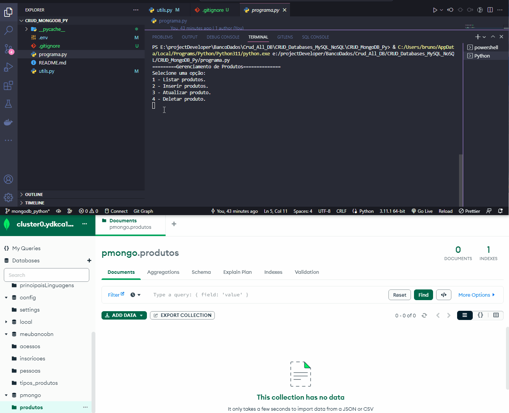

# CRUD MongoDB and Python

Criando um CRUD Com banco de dados não relacinal MongoDB em linguagem Python

#

### Skills:

* Funções
* Bibliotecas
    * Pymongo:
    * ``` pip install pymongo ```
    * Dotenv:
    * ```pip install python-dotenv```
    * Imports:
    ```from pymongo import MongoClient, errors
      from bson.objectid import ObjectId
      import dotenv
      import os
    ```


#

<div align="center">
    <h4>CRUD MongoDB VS Python:</h4>
    
</div>
