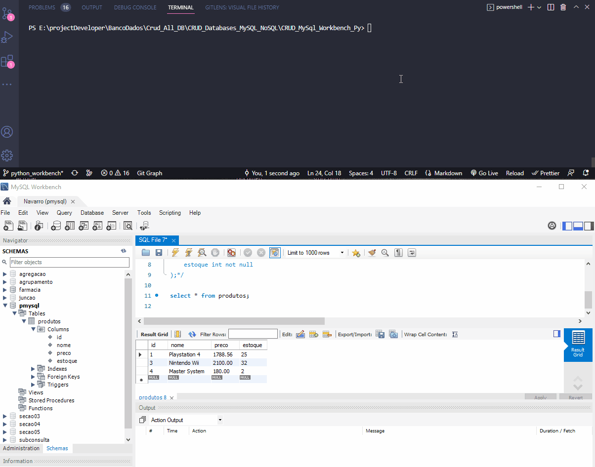

# CRUD MySQL Workbanch and Python

> Criando aplicação CRUD em python usando MySQL WorkBench

#

### SKills:

* Stacks:
    * VsCode
    * Python
    * MySQL WorkBench

* Funções

* bibliotecas:
    * import MySQLdb
    * import dotenv
    * import os

#

    <h4>Projeto CRUD: </h4>
    

